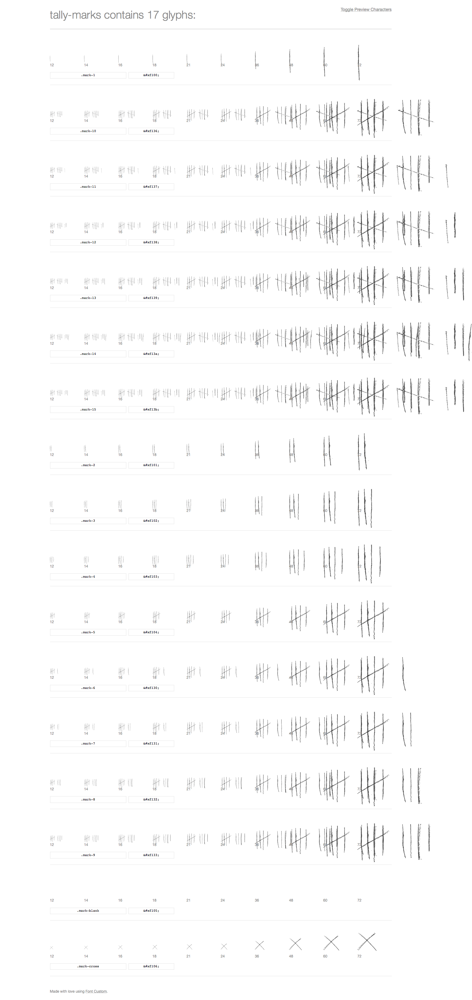

# Tally Marks Fonts #

This font contains 16 glyphs (1–15) with corresponding ligatures. 

## Font Creation Process #

This font is generated using [dashie](https://github.com/dashie/fontcustom)’s fork of [fontcustom](https://github.com/FontCustom/fontcustom) to automatically add ligatures from glyph names.

## This repository #

The directory `fonts` contains the compiled font face kit including css and html preview files.

fontcustom uses the svgs from the `glyphs` directory to compile the font. These glyphs were generated by the `composeglyphs.py` script using the templates from the `vector` folder.

`composeglyphs.py` uses [svg_stack](https://github.com/astraw/svg_stack) to concatenate the template files.

This font is a proof of concept. Pretty sure there are better ways and more eligible ways to define tally marks ligatures in fonts.
